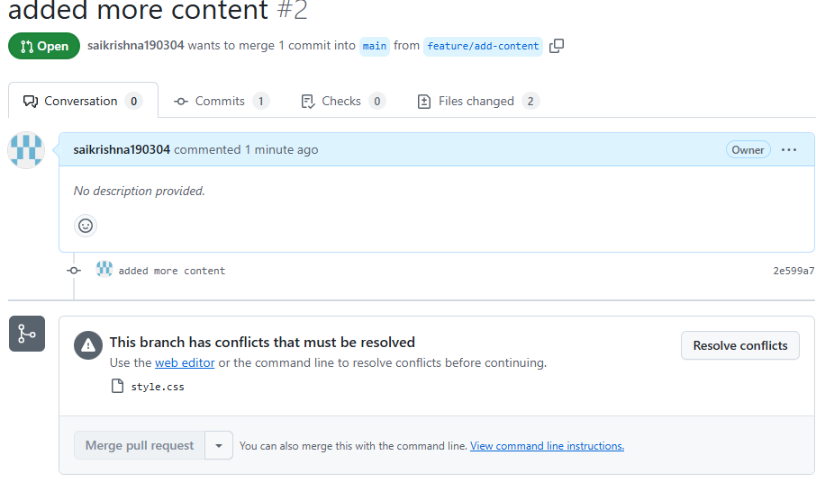
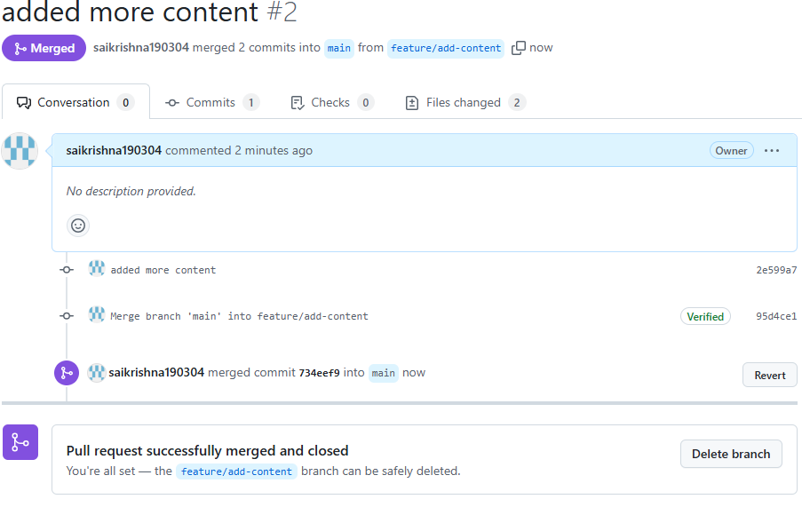

## screeshots of merge conflicts 

## clear description of outcomes
For this assignment, I set up a GitHub repo and uploaded some basic HTML and CSS files. Then, I created two branches: one to update the styles feature/update-styling and another to add new content and tweak both the HTML and CSS feature/add-content. After committing to both branches, I was able to merge the first branch without any problems. However, when I tried merging the second one, a conflict appeared in the CSS file, which I fixed directly on GitHub by choosing the right changes from both branches.
